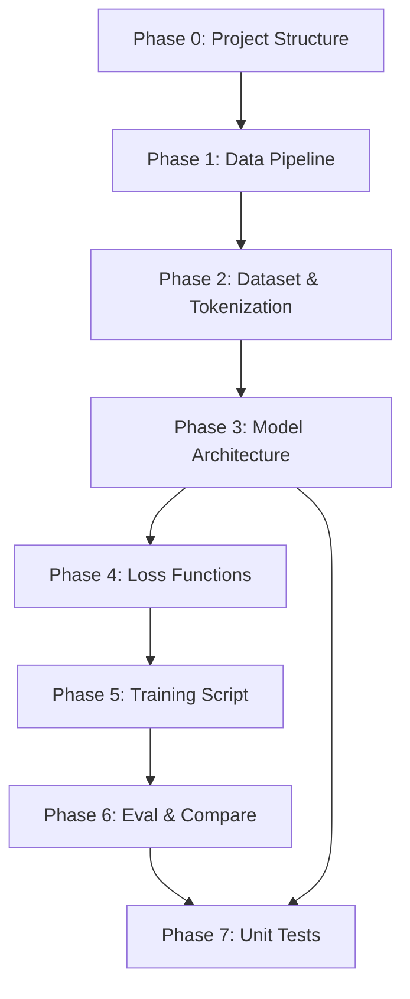
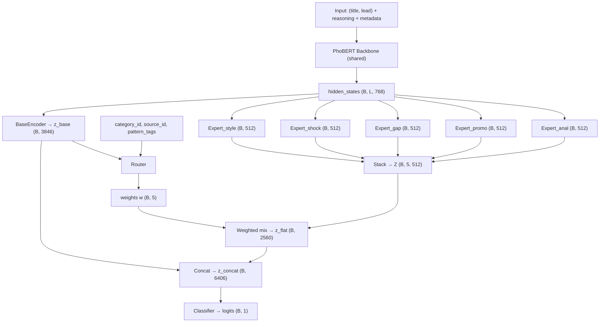

# ICDv5 Modular Pattern-Expert Framework — Implementation Plan

> **Nguồn gốc:** Dựa trên `implement/ICDv5_implementation_plan.md`, đã được review và điều chỉnh paths theo `project_structure.yaml` thực tế.

> **Tham khảo:**
> - ORCD (Zhang et al., WWW'26): arXiv:2601.12019 — Opposing-stance reasoning
> - MMBERT (2025): 3-stage progressive training cho MoE + BERT
> - PERFT (arXiv:2411.08212): Parameter-Efficient Routed Fine-Tuning
> - Mixture of Routers (arXiv:2503.23362): Multi-router MoE architecture

---

## User Review Required

> [!IMPORTANT]
> **Path corrections:** File `ICDv5_implementation_plan.md` gốc đề xuất lưu results vào `result/results_icdv5/` — nhưng convention thực tế của project là dùng `src/experience/icdv5/`. Plan này đã sửa tất cả paths theo convention thực tế.

> [!WARNING]
> **GPU Memory:** ICDv5 thêm 5 Expert modules + Router so với ICDv4. Trên RTX 3050 (4GB), batch_size phải giữ ở 2 với gradient accumulation = 16. Experts tái sử dụng hidden states từ PhoBERT backbone (không chạy thêm forward pass), nên memory overhead chỉ từ adapter layers (~5×512×768 params).

> [!IMPORTANT]
> **LLM API cost:** Phase 1.2 (sinh reasoning) và Phase 1.3 (sinh pattern tags) yêu cầu gọi LLM API (gpt-3.5-turbo). Cần xác nhận budget và API key trước khi chạy. Nếu đã có reasoning từ ICDv4 thì có thể tái sử dụng.

---

## Open Questions

1. **Tái sử dụng reasoning ICDv4?** Dữ liệu reasoning đã có tại `data/processed/icdv4/Cleaned_Clickbait_with_reasoning.parquet`. ICDv5 có dùng lại hay cần sinh lại?

2. **Pattern tags LLM model:** Dùng `gpt-3.5-turbo-1106` (rẻ) hay `gpt-4o-mini` (chính xác hơn) cho việc gán pattern tags?

3. **Số experts K=5 hay K=6?** Plan gốc đề xuất K=5 (gộp hardnews vào gap/analysis), nhưng pattern tags có 6 loại. Nên giữ K=5 hay mở rộng K=6?

4. **Contrastive loss:** Có giữ contrastive loss từ ICDv4 không? Nếu có, cần reasoning encoders (TF/TA) → tăng complexity. Plan gốc đánh dấu "optional".

5. **Phase 1 Expert Pretrain:** Có thực hiện phase pretrain experts riêng hay train joint từ đầu?

---

## Proposed Changes

### Dependency Graph



---

### Phase 0 — Project Structure Update

#### [MODIFY] [project_structure.yaml](file:///mnt/c/Users/Admin/HUIT%20-%20Học%20Tập/Năm%203/Semester_2/Class/Capstone%20Project/project_structure.yaml)

Thêm các entries mới cho ICDv5:

```yaml
# Trong data/processed/subdirectories:
icdv5:
  description: "Datasets enriched with reasoning + pattern tags for ICDv5."

# Trong src/ICD/files:
- ICD_Model_v5.py: "Architecture for ICDv5 (Modular Pattern-Expert + Router)."
- dataset_icdv5.py: "Dataset class cho ICDv5 với pattern tags và metadata."
- losses_v5.py: "Loss functions cho ICDv5 (Focal + KL + Router + Contrastive)."

# Trong src/experience/subdirectories:
icdv5:
  description: "Logs, metrics, checkpoints for ICDv5 modular expert model."

# Trong training/ICD/files:
- train_ICD_v5.py
- compare_v3_v4_v5.py

# Trong test/files:
- test_icdv5_shapes.py
```

**Directories cần tạo:**
- `data/processed/icdv5/`
- `src/experience/icdv5/checkpoints/`
- `src/experience/icdv5/results/`

---

### Phase 1 — Data Pipeline

#### 1.1. [NEW] [prepare_icdv5_data.py](file:///mnt/c/Users/Admin/HUIT%20-%20Học%20Tập/Năm%203/Semester_2/Class/Capstone%20Project/data/processed/icdv5/prepare_icdv5_data.py)

**Mục tiêu:** Chuẩn hóa schema từ cleaned dataset.

| Input | Output |
|-------|--------|
| `data/processed/cleaned/train_clean.csv` | `data/processed/icdv5/icdv5_train_base.parquet` |
| `data/processed/cleaned/validate_clean.csv` | `data/processed/icdv5/icdv5_valid_base.parquet` |
| `data/processed/cleaned/test_clean.csv` | `data/processed/icdv5/icdv5_test_base.parquet` |

**Logic:**
1. Đọc 3 file CSV từ `cleaned/`
2. Chuẩn hóa label: `clickbait` → 1, `non-clickbait` → 0
3. Chọn cột: `id`, `title`, `lead_paragraph`, `category`, `source`, `label`
4. Lưu Parquet

> [!NOTE]
> Path correction: Plan gốc dùng `train.csv` (ở `data/processed/`), nhưng project convention dùng `train_clean.csv` (ở `data/processed/cleaned/`).

---

#### 1.2. Reasoning — Tái sử dụng từ ICDv4

**Nếu tái sử dụng reasoning ICDv4:**
- Source: `data/processed/icdv4/Cleaned_Clickbait_with_reasoning.parquet`
- Extract: `agree_reason`, `disagree_reason`, `rating_init`, `rating_agree`, `rating_disagree` → map sang `reason_agree_vi`, `reason_disagree_vi`, `score_init`, `score_agree`, `score_disagree`
- Lưu: `data/processed/icdv5/icdv5_{split}_reasoning.parquet`

**Nếu cần sinh mới:** Dùng `src/ICD/reasoning/generate_reasoning.py` (đã có).

---

#### 1.3. [NEW] [generate_pattern_tags.py](file:///mnt/c/Users/Admin/HUIT%20-%20Học%20Tập/Năm%203/Semester_2/Class/Capstone%20Project/src/ICD/reasoning/generate_pattern_tags.py)

**Mục tiêu:** Gán multi-label pattern tags cho mỗi sample bằng LLM (offline).

**6 pattern tags:**

| Tag | Mô tả | Ví dụ |
|-----|--------|-------|
| `tag_shock` | Crime/sex/disaster, tin giật gân | "Kinh hoàng: ..." |
| `tag_lifestyle` | Showbiz, đời sống, human story | "Sao Việt ...", "Mẹ bỉm sữa ..." |
| `tag_listicle` | Dạng list, tips | "10 cách ...", "X lý do ..." |
| `tag_analysis` | Phân tích, Q&A serious | "Vì sao GDP ...", "Chuyên gia nói gì?" |
| `tag_promo` | Quảng bá, sự kiện, brand | "Ra mắt ...", "Deal hot ..." |
| `tag_hardnews` | Tin ngắn, thời sự trung lập | "Thủ tướng tiếp ...", "UBND TP..." |

**I/O:**

| Input | Output |
|-------|--------|
| `icdv5_{split}_base.parquet` | `data/processed/icdv5/icdv5_{split}_patterns.parquet` |

**Implementation:**
- Prompt LLM với `(title, lead_paragraph)` → output JSON `{tag_shock: 0/1, ...}`
- Batch processing với rate limiting + checkpoint
- Follow pattern từ `generate_reasoning.py` (checkpoint, resume, logging)

---

#### 1.4. [NEW] [build_icdv5_dataset.py](file:///mnt/c/Users/Admin/HUIT%20-%20Học%20Tập/Năm%203/Semester_2/Class/Capstone%20Project/data/processed/icdv5/build_icdv5_dataset.py)

**Mục tiêu:** Merge base + reasoning + patterns → final dataset.

**Logic:** Join theo `id` column:
```
base.parquet + reasoning.parquet + patterns.parquet → icdv5_{split}_full.parquet
```

**Schema cuối (mỗi file):**

| Column | Type | Nguồn |
|--------|------|-------|
| `id` | str | base |
| `title` | str | base |
| `lead_paragraph` | str | base |
| `category` | str | base |
| `source` | str | base |
| `label` | int (0/1) | base |
| `reason_agree_vi` | str | reasoning |
| `reason_disagree_vi` | str | reasoning |
| `score_init` | float [0,100] | reasoning |
| `score_agree` | float [0,100] | reasoning |
| `score_disagree` | float [0,100] | reasoning |
| `tag_shock..tag_hardnews` | int (0/1) ×6 | patterns |

**Output:**
- `data/processed/icdv5/icdv5_train_full.parquet`
- `data/processed/icdv5/icdv5_valid_full.parquet`
- `data/processed/icdv5/icdv5_test_full.parquet`

---

### Phase 2 — Dataset & Tokenization

#### [NEW] [dataset_icdv5.py](file:///mnt/c/Users/Admin/HUIT%20-%20Học%20Tập/Năm%203/Semester_2/Class/Capstone%20Project/src/ICD/dataset_icdv5.py)

**Mục tiêu:** PyTorch Dataset class cho ICDv5.

**VnCoreNLP preprocessing:** Tất cả text phải qua VnCoreNLP segmenter trước khi tokenize (per user rule). Cache segmented text vào parquet.

**Tokenization (per user rule — `tokenizer(text_a, text_b)`):**

| Tensor | text_a | text_b | max_len |
|--------|--------|--------|---------|
| `input_ids_news` | `title_seg` | `lead_seg` | 256 |
| `input_ids_reason_agree_tf` | `reason_agree_seg` | None | 128 |
| `input_ids_reason_disagree_tf` | `reason_disagree_seg` | None | 128 |
| `input_ids_reason_agree_ta` | `title_seg` | `reason_agree_seg` | 256 |
| `input_ids_reason_disagree_ta` | `title_seg` | `reason_disagree_seg` | 256 |

**Metadata tensors:**

| Tensor | Shape | Mô tả |
|--------|-------|--------|
| `category_id` | `(B,)` | Integer ID từ category→id mapping |
| `source_id` | `(B,)` | Integer ID từ source→id mapping |
| `pattern_tags` | `(B, 6)` | Float32, từ 6 cột tag_* |
| `label` | `(B,)` | Float32, 0/1 |
| `soft_label_llm` | `(B,)` | Float32, normalized từ scores |

**Quan trọng:**
- Category/source mapping phải được build từ training set → save JSON → reuse cho val/test
- `soft_label_llm` = `score_init / 100.0` (chuẩn hóa [0,100] → [0,1])

---

### Phase 3 — Model Architecture

#### [NEW] [ICD_Model_v5.py](file:///mnt/c/Users/Admin/HUIT%20-%20Học%20Tập/Năm%203/Semester_2/Class/Capstone%20Project/src/ICD/ICD_Model_v5.py)

**Tổng quan kiến trúc:**



**Dimension constants:**

```python
H = 768           # PhoBERT hidden size
NUM_AUX = 6       # Auxiliary features
D_BASE = 5*H + NUM_AUX  # 3846
D_EXP = 512       # Per-expert output
K_EXPERT = 5      # Number of experts
D_EXP_TOTAL = D_EXP * K_EXPERT  # 2560
D_ROUTER = 512    # Router hidden size
D_CLS = D_BASE + D_EXP_TOTAL    # 6406
```

**Modules tái sử dụng từ ICDv4:**
- `SegmentAwarePool` — tách title/lead tokens
- `WeightedLayerPool` — weighted sum last 4 hidden states
- `AttentionPool` — attention pooling cho expert modules

**Modules mới:**

1. **`ExpertModule(nn.Module)`** — Adapter nhỏ per pattern domain:
   - Input: `(hidden_states, attention_mask)` từ shared PhoBERT
   - `AttentionPool(H)` → `(B, H)`
   - `Linear(H, H) → GELU → LayerNorm(H) → Linear(H, D_EXP)` → `(B, 512)`

2. **`Router(nn.Module)`** — Supervised routing:
   - Input: `z_base (B, D_BASE)`, `category_id (B,)`, `source_id (B,)`, `pattern_tags (B, 6)`
   - `cat_emb(32) + src_emb(32) + pattern_proj(32)` = 96
   - `FC(D_BASE+96 → D_ROUTER → K)` → softmax → `w (B, K)`

3. **`ICDv5(nn.Module)`** — Main model:
   - `encode_news()` → `z_base (B, 3846)` + `last_hidden (B, L, H)`
   - 5× `ExpertModule` trên `last_hidden` → `Z (B, 5, 512)`
   - `Router` → `w (B, 5)`
   - `z_flat = Z.view(B, -1)` → `(B, 2560)`
   - `z_concat = cat(z_base, z_flat)` → `(B, 6406)`
   - `Classifier(6406 → 1024 → 256 → 1)` → `logits (B, 1)`

**Methods:**
- `forward()` → `(logits, z_base, router_weights, router_logits)`
- `freeze_backbone_layers(freeze_until)` — kế thừa từ v4
- `get_parameter_groups(lr, lr_decay)` — layer-wise LR decay

> [!IMPORTANT]
> Experts nhận `last_hidden` từ **1 lần** PhoBERT forward pass duy nhất. KHÔNG chạy PhoBERT riêng cho mỗi expert → tiết kiệm VRAM đáng kể.

---

### Phase 4 — Loss Functions

#### [NEW] [losses_v5.py](file:///mnt/c/Users/Admin/HUIT%20-%20Học%20Tập/Năm%203/Semester_2/Class/Capstone%20Project/src/ICD/losses_v5.py)

**Kế thừa từ `losses.py` (v4):**
- `FocalLossWithSmoothing` — binary focal loss
- `SoftLabelKLLoss` — KL với LLM soft labels
- `rdrop_loss` — R-Drop regularization

**Mới cho v5:**

1. **`RouterSupervisionLoss`:**
   - Input: `router_logits (B, K)`, `pattern_tags (B, 6)` → map sang `(B, K)` target
   - Normalize pattern_tags → distribution `w_target`
   - `KLDivLoss(log_softmax(router_logits), w_target)`
   - Entropy regularizer: `λ_ent * mean(w * log(w))`

2. **`ICDv5CombinedLoss`:**
   ```python
   L = L_focal + λ_kl * L_kl_llm + λ_router * L_router + λ_contr * L_contrastive + L_rdrop
   ```

   | Loss | Weight param | Default |
   |------|-------------|---------|
   | `L_focal` | — | 1.0 |
   | `L_kl_llm` | `lambda_kl` | 0.5 |
   | `L_router` | `lambda_router` | 0.3 |
   | `L_contrastive` | `alpha_contrastive` | 0.3 (optional) |
   | `L_rdrop` | `beta_rdrop` | 1.0 |

---

### Phase 5 — Training Script

#### [NEW] [train_ICD_v5.py](file:///mnt/c/Users/Admin/HUIT%20-%20Học%20Tập/Năm%203/Semester_2/Class/Capstone%20Project/training/ICD/train_ICD_v5.py)

**Cấu trúc:** Kế thừa pattern từ `train_ICD_v4.py`.

**CLI arguments mới (thêm vào args v4):**

| Flag | Type | Default | Mô tả |
|------|------|---------|--------|
| `-lr_router` | float | 0.3 | λ_router |
| `-le` | float | 0.01 | λ_entropy |
| `-nexp` | int | 5 | Số experts K |
| `--phase1_epochs` | int | 5 | Epochs cho Phase 1 pretrain |
| `--skip_phase1` | bool | False | Bỏ qua expert pretrain |

**Training phases (theo MMBERT progressive paradigm):**

**Phase 1 — Expert Pretrain (optional):**
- Freeze PhoBERT backbone hoàn toàn
- Train experts + router với task phụ: predict pattern_tags
- Loss: `CrossEntropy(expert_pred, pattern_tags)` + `KL(router_logits, pattern_dist)`
- 5 epochs, lr = 1e-3

**Phase 2 — Joint Training:**
- Unfreeze top PhoBERT layers (freeze 0-8, train 9-11)
- Full loss: Focal + KL_LLM + Router + Contrastive + R-Drop
- AdamW + cosine warmup scheduler
- Early stopping on val F1

**Paths:**

| Item | Path |
|------|------|
| Data | `data/processed/icdv5/icdv5_{split}_full.parquet` |
| Segmented cache | `data/processed/icdv5/{split}_segmented.parquet` |
| Checkpoint | `src/experience/icdv5/checkpoints/{run_name}/icdv5_best.pt` |
| Results | `src/experience/icdv5/results/{run_name}/test_metrics_full.json` |
| Predictions | `src/experience/icdv5/results/{run_name}/test_predictions_full.parquet` |

> [!NOTE]
> Path correction: Plan gốc dùng `result/results_icdv5/` — đã sửa sang `src/experience/icdv5/` theo convention của ICDv4.

**Hardware profiles:**

| Profile | Batch | Grad Acc | Workers | AMP |
|---------|-------|----------|---------|-----|
| rtx3050 | 2 | 16 | 2 | ✓ |
| rtxa4000 | 8 | 4 | 4 | ✓ |
| ada5000 | 16 | 2 | 8 | ✓ |

---

### Phase 6 — Evaluation & Comparison

#### [MODIFY] [eval_only.py](file:///mnt/c/Users/Admin/HUIT%20-%20Học%20Tập/Năm%203/Semester_2/Class/Capstone%20Project/training/ICD/eval_only.py)

Thêm `--model v5` option để load ICDv5 checkpoint và evaluate.

#### [NEW] [compare_v3_v4_v5.py](file:///mnt/c/Users/Admin/HUIT%20-%20Học%20Tập/Năm%203/Semester_2/Class/Capstone%20Project/training/ICD/compare_v3_v4_v5.py)

**Mục tiêu:** So sánh 3 model versions.

**Input predictions:**

| Model | Path |
|-------|------|
| ICDv3 | `src/experience/ICDv3/test_predictions_full.parquet` |
| ICDv4 | `src/experience/icdv4/results/{run}/test_predictions_full.parquet` |
| ICDv5 | `src/experience/icdv5/results/{run}/test_predictions_full.parquet` |

**Output:**
- Metrics comparison table (Acc, P, R, F1)
- McNemar test (v3 vs v5, v4 vs v5)
- Confusion matrices (3 models)
- Calibration curves
- F1 per pattern subset (SHOCK, LIFESTYLE, LISTICLE, ANALYSIS, PROMO, HARDNEWS)
- Report: `src/experience/comparison/comparison_icdv3_icdv4_icdv5.md`

---

### Phase 7 — Unit Tests

#### [NEW] [test_icdv5_shapes.py](file:///mnt/c/Users/Admin/HUIT%20-%20Học%20Tập/Năm%203/Semester_2/Class/Capstone%20Project/test/test_icdv5_shapes.py)

**Test cases:**

```python
B, L_n, L_r = 2, 256, 128

# Test 1: BaseEncoder output shape
assert z_base.shape == (B, 3846)

# Test 2: Expert outputs
assert Z_expert.shape == (B, 5, 512)

# Test 3: Router weights
assert router_weights.shape == (B, 5)
assert torch.allclose(router_weights.sum(dim=-1), torch.ones(B))  # softmax

# Test 4: Final logits
assert logits.shape == (B, 1)

# Test 5: No NaN/Inf
assert not torch.isnan(logits).any()
assert not torch.isinf(logits).any()
```

---

## Tóm tắt Files & Paths

| # | File | Path (từ project root) | Status |
|---|------|------------------------|--------|
| 1 | `prepare_icdv5_data.py` | `data/processed/icdv5/` | NEW |
| 2 | `generate_pattern_tags.py` | `src/ICD/reasoning/` | NEW |
| 3 | `build_icdv5_dataset.py` | `data/processed/icdv5/` | NEW |
| 4 | `dataset_icdv5.py` | `src/ICD/` | NEW |
| 5 | `ICD_Model_v5.py` | `src/ICD/` | NEW |
| 6 | `losses_v5.py` | `src/ICD/` | NEW |
| 7 | `train_ICD_v5.py` | `training/ICD/` | NEW |
| 8 | `compare_v3_v4_v5.py` | `training/ICD/` | NEW |
| 9 | `test_icdv5_shapes.py` | `test/` | NEW |
| 10 | `eval_only.py` | `training/ICD/` | MODIFY |
| 11 | `project_structure.yaml` | `.` | MODIFY |

---

## Verification Plan

### Automated Tests

1. **Shape tests:** `conda run -n MLE python -m pytest test/test_icdv5_shapes.py -v`
2. **Dry run:** `conda run -n MLE python training/ICD/train_ICD_v5.py --hw_profile rtx3050 --dry_run`
3. **Data pipeline:** Verify parquet files have correct schema và row counts

### Manual Verification

1. Kiểm tra GPU memory usage khi dry run trên RTX 3050
2. Review pattern tags quality trên 50 samples random
3. So sánh F1 metrics giữa v3/v4/v5 sau khi train xong
